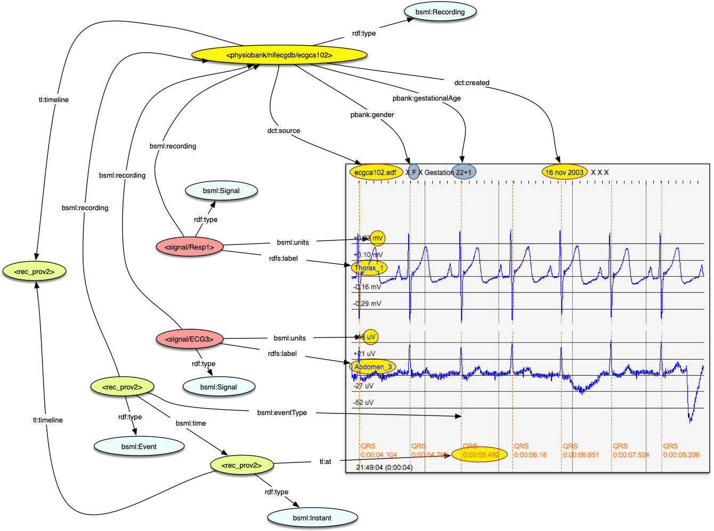

# BioSignalML

BioSignalML was developed as part of a PhD research project which examined how semantic web concepts could be applied to physiological time series data. It started with the observation that while there are only so many well-defined ways a sequence of numbers can be stored, there was minimal standardisation of how metadata about these numbers is described and exchanged. The original thesis is available [online](https://auckland.primo.exlibrisgroup.com/permalink/64UAUCK_INST/13vfdcn/alma99261387214002091).

At one level, BiosignalML is an open set of abstract concepts formalised as an ontology. However, as an example use case, it includes the specification of an HDF5 file structure along with associated software for working with BioSignalML files.

Applications developed to use BioSignalML have included...

<figure >
    
    <figcaption>Ontology classes and properties.</figcaption>
</figure>
<figure >
    
    <figcaption>BioSignalML markup of an EDF+ file.</figcaption>
</figure>

<!-- 

## The author

A short CV??

-->
