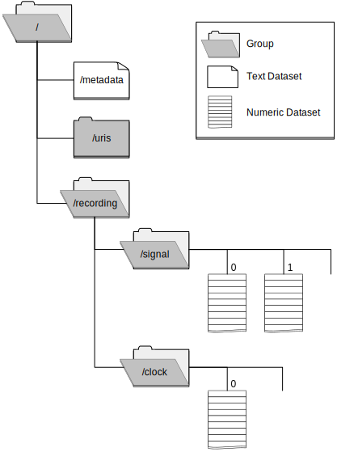

# BioSignalML HDF5 File Layout

[HDF5](https://hdfgroup.org/HDF5/) provides a mature, robust, multi-platform, well supported data
model and file format able to describe and efficiently store and
retrieve very large quantities of data. The following specifies an HDF5
file layout for storing biosignals, having as its basis the BioSignalML
abstract model.

## General structure

The following figure illustrates the general
structure of a BioSignalML HDF5 file, showing the HDF5 *group*s and
*dataset*s, and the relationships between them.

<figure id="fig:hdf5-model">
    
    <figcaption>General structure of a BioSignalML HDF5 file.</figcaption>
</figure>

### Single recording per file

A BioSignalML HDF5 file **MUST** only contain a single Recording.

A Recording is the container object of the BioSignal model to which
other objects are related, and requiring a one-to-one relationship
between Recordings and files is a natural fit. HDF5, because of its
hierarchical structure, would support multiple Recordings in a file, and
providing for this is a possible future extension.

### Version attribute

A BioSignalML HDF5 file **MUST** have a string valued attribute with a name
of *version* on the root group ('/'), and whose value **MUST** start with
the five characters *BSML* and then be followed by major and minor
version numbers, separated by a period ('.').

The initial version of the BioSignalML HDF5 File Layout SHALL have a
major version number of '1' and a minor version number of '0' --- i.e.
the version string is *BSML 1.0*

It is expected that new releases, while possibly introducing new
features, will maintain backwards compatibility with prior versions.

### URI index

A BioSignalML HDF5 file **MUST** have a group named */uris*. This group's
attributes **MUST** have names which are the URIs of the Recording, its
Signals, and any Clocks in the file. The value of an attribute **MUST** be
that of an HDF5 reference to the group or dataset of the Recording,
Signal or Clock.

### Recording group

A BioSignalML HDF5 file **MUST** have a group named */recording* and this
group **MUST** have a string attribute named *uri*. The value of this
attribute is the URI of the Recording.

This group will have a *signal* sub-group, and possibly a *clock*
sub-group, containing respective signal and timing datasets.

### RDF metadata

A BioSignalML HDF5 file **MAY** have a dataset named */metadata*, containing
an RDF serialisation of metadata associated with the Recording, stored
as a UTF-8 string. The dataset **MAY** have an attribute named *mimetype*,
giving the format of the RDF serialisation, using standard IANA
registered mimetypes. If the attribute is missing the format is assumed
to be *application/rdf+xml*.

This RDF would typically be the contents of the named graph containing
all metadata about the Recording, and be as stored in a repository or
triplestore.

### Signal group and datasets {#sect:signal-group}

A BioSignalML HDF5 file **MUST** have a */recording/signal* group to contain
signal datasets.

The */recording/signal* group **MAY** contain one or more signal datasets.
Signal datasets **MUST** be consecutively numbered, starting from zero.
(i.e. the first signal dataset will have a name of
*/recording/signal/0*).

Each signal dataset **MUST** have an attribute named *uri*. The value of
this attribute must either be the URI of the signal as a string, or it
must be an array of strings. If an array, the signal is made up of a
number of channels (sharing the same timing), each with a URI given by
the corresponding array element.

Each signal dataset **MUST** have an attribute named *units*. The value of
this attribute must either be a string giving the physical units of
measurement of the signal, or when the signal consists of multiple
channels, it must be an array of strings with each element giving the
physical units of measurement of the corresponding signal channel.

Each signal dataset **MUST** have one, and only one, attribute with a name
of either *rate*, *period* or *clock*.

If a signal dataset has an attribute named *rate* or *period*, its value
**MUST** be a floating point number. The dataset **MAY** then have a *timeunits*
attribute, giving the units of measurement of the sampling *period*,
with the units of measurement of the sampling *rate* being the
reciprocal. Default time units are seconds, that is the default units
for *rate* is Hertz.

If a signal dataset has an attribute named *clock* then its value **MUST**
be a reference to some HDF5 dataset in the */recording/clock* group.

Each signal dataset **MAY** have an attribute named *starttime* as a
floating point number, giving the *timeunits* offset from the start of
the Recording to the start of the signal. The default value is *0.0*.

Each signal dataset **MAY** have attributes named *gain* and/or *offset*,
having floating point values, defaulting to *1.0* and *0.0*
respectively. The physical value of a signal is obtained by subtracting
any offset from the value stored in a dataset before multiplying by the
gain.

### Clock group and datasets

If any signal dataset has a *clock* attribute the BioSignalML HDF5 file
**MUST** have a group named */recording/clock*, to contain clock datasets.

The */recording/clock* group **MUST** contain a dataset for each separate
*clock* attribute of signal datasets. Clock datasets **MUST** be
consecutively numbered, starting from zero. (i.e. the first clock
dataset will have a name of */recording/clock/0*).

Each clock dataset **MUST** have an attribute named *uri*. The value of this
attribute must be a string, the URI of the clock.

Each clock dataset **MAY** have an attribute named *units*, whose value is
the physical units of measurement of the clock. The default units of
measurement is seconds.

Each clock dataset **MAY** have an attribute named *starttime* as a floating
point number, giving the *units* offset from the start of the Recording
to the start of the clock's times. The default value is *0.0*.

Each clock dataset **MAY** have an attribute named *scale*, being a floating
point number with which to multiply values stored in the dataset to
obtain physical values of time points. The default value is *1.0*.

## Discontinuous signals

A signal may consist of several discontinuous segments. In this case, a
signal's dataset is replaced by a group and reference by the signal's
URI entry in the attributes of the */uris* group.

### Signal group and segment datasets

If the HDF5 object corresponding to a signal's URI is an HDF5 group
(instead of an HDF5 dataset) then the signal is discontinuous and the
group **MAY** contain one or more segment datasets. Segment datasets **MUST** be
consecutively numbered, starting from zero. (i.e. the first segment
dataset of the first signal will have a name of
*/recording/signal/0/0*).

The signal group **MUST** have attributes named *uri* and *units* with
values having the same meaning as defined for signal datasets [above](#sect:signal-group).

Each segment dataset **MUST** have one, and only one, attribute with a name
of either *rate*, *period* or *clock*, and **MAY** have an attribute named
*timeunits*, with values having the same meaning as defined for signal
datasets [above](#sect:signal-group).

Each segment dataset **MUST** have an attribute named *starttime* as a
floating point number, giving the *timeunits* offset from the start of
the Recording to the start of the segment.

Each segment dataset **MAY** have attributes named *gain* and/or *offset*,
with values having the same meaning as defined for signal datasets [above](#sect:signal-group).

## Units of measurement

Units of measurement **SHOULD** be specified using pre-defined unit URIs
from the Units of Measurement Expressions List at
<http://www.sbpax.org/uome/list.html>, and if not, then as URIs of
resources defined using the UOME Core vocabulary.
