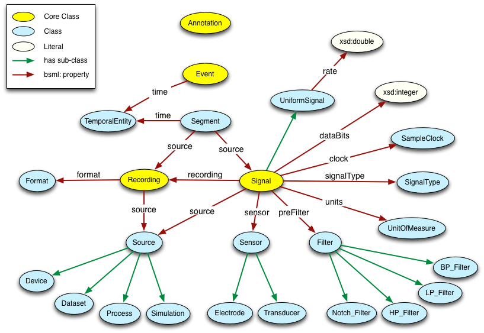

# BioSignalML Ontology

The BioSignalML Ontology defines concepts used in the storage and exchange of biosignals,
along with terms for common biosignal metadata elements. The following shows the relationships between these concepts:

<figure>
    
    <figcaption>The BioSignalML Ontology.</figcaption>
</figure>

## Documentation

A human readable version of the ontology is at https://www.biosignalml.org/ontologies/2025/12/biosignalml.html (the page opens in a new window).

## RDF version

An RDF (Turtle) version of the ontology is at https://www.biosignalml.org/ontologies/2025/12/biosignalml.
